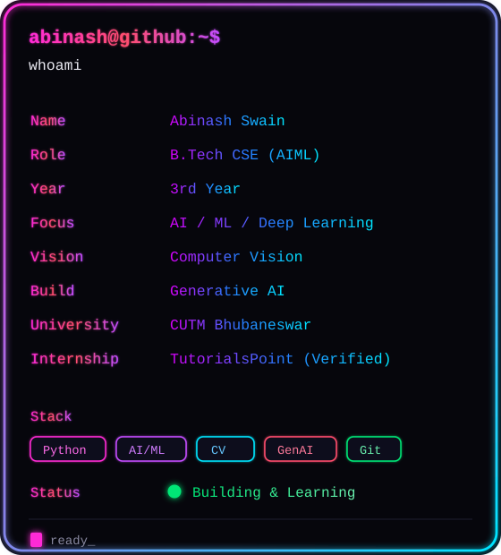

<div align="center">

# 🦇 `abinash123hg@github`

<br>

### `abinash123hg@github ~ $ whoami`

<table>
<tr>
<td valign="top" width="40%">

</td>
<td valign="top" width="60%">

</td>
</tr>
</table>

<br>

### `echo "Thanks for visiting!"`

</div>

---
---

<p align="center">
  
</p>

<p align="center">
  
</p>

<p align="center">
  
</p>

## 🐍 Contribution Snake

<p align="center">
  
</p>

---

## 🛠️ Tech Stack

### Languages


### AI / ML & Deep Learning


### Data Science


### Web & Frameworks


### Cloud & Databases


### Developer Tools


### Design


---

## 📊 Expertise Matrix

| Area                    | Skill                    | Level        | Details                           |
|-------------------------|--------------------------|--------------|-----------------------------------|
| **Machine Learning**    | Algorithms & Models      | 🟢🟢🟢🟡⚪   | Classification, Regression, NLP   |
| **Deep Learning**       | Neural Networks          | 🟢🟢🟡⚪⚪   | CNN, RNN, Transformers (Learning) |
| **Python Development**  | OOP & Data Structures    | 🟢🟢🟢🟢⚪   | Strong Foundation                 |
| **Web Development**     | Django & APIs            | 🟢🟢🟢⚪⚪   | REST APIs, Microservices          |
| **Data Science**        | Analysis & Visualization | 🟢🟢🟢🟡⚪   | Pandas, NumPy, Matplotlib         |
| **Generative AI**       | LLMs & Prompting         | 🟢🟢🟡⚪⚪   | Currently Exploring               |
| **Cloud**               | AWS & Databases          | 🟢🟢🟡⚪⚪   | Learning Phase                    |
| **Version Control**     | Git & GitHub             | 🟢🟢🟢🟢⚪   | Advanced Usage                    |

---

## 🎯 Currently Doing

### 🧠 Learning
- Deep Learning Architecture & Optimization  
- Large Language Models (LLMs)  
- System Design Patterns  
- Production ML Pipelines  
- Advanced Algorithms  

### 💻 Building
- AI/ML Portfolio Projects  
- Django Web Applications  
- Streamlit Interactive Dashboards  
- Open Source Contributions  
- ML Research Experiments  

### 🤝 Open To
- **Internships** in AI/ML  
- **Collaborations** on innovative projects  
- **Mentorship** from industry experts  
- **Networking** with professionals  
- **Open Source** contributions  

---

## 🏆 Special Achievements

<div align="center">

#### Quickdraw
<a href="https://github.com/users/abinash123hg/achievements/quickdraw">
  
</a>

#### YOLO
<a href="https://github.com/users/abinash123hg/achievements/yolo">
  
</a>

</div>

---

## 📊 Contribution Graph

<div align="center">


</div>

---

## 💼 Featured Projects

<details open>
<summary><b>🚀 AI/ML Portfolio Projects</b></summary>

<br>

| Project                  | Focus                | Tech Stack                     | Status       |
|--------------------------|----------------------|--------------------------------|--------------|
| **Predictive Analytics** | Regression Models    | Python, Scikit-learn, Pandas   | Active       |
| **Deep Learning Models** | CNNs & RNNs          | TensorFlow, Keras, PyTorch     | In Progress  |
| **NLP Applications**     | Text Analysis        | NLTK, spaCy, Transformers      | Learning     |
| **Web Integration**      | ML APIs              | Django, FastAPI, Streamlit     | Building     |
| **Data Visualization**   | Analytics Dashboards | Matplotlib, Plotly, Seaborn    | Active       |
| **Open Source**          | Community Projects   | Python, ML Libraries           | Contributing |

**Explore all repositories →** [github.com/abinash123hg](https://github.com/abinash123hg?tab=repositories)

</details>

---

## 📚 Education

**Bachelor of Technology (B.Tech)**  
- **Program:** Computer Science & Engineering (AIML Specialization)  
- **University:** Centurion University of Technology and Management (CUTM)  
- **Location:** Bhubaneswar, Odisha, India  
- **Current Year:** 3rd Year  
- **Focus Areas:** Artificial Intelligence • Machine Learning • Deep Learning • Data Science  

**Internship:** TutorialsPoint (Certificate Verified)

---

## 💬 Quote

<div align="center">


</div>

---

## 🌐 Connect With Me

<div align="center">

[](https://www.linkedin.com/in/abinash-swain-a941a3330/)
[](mailto:swainabinash839@gmail.com)
[](https://github.com/abinash123hg)
[](https://instagram.com/badnaam_editors)
[](https://medium.com/@Subha)

</div>

---

## 📌 Featured Repository

<div align="center">

### 🚀 Featured Projects

<table>
  <tr>
    <td width="50%" valign="top">
      <h3>🛡️ SafeDrive AI</h3>
      <p>AI-powered driver monitoring system that detects drowsiness, distraction & phone usage in real-time using computer vision.</p>
      <p>
        <a href="https://github.com/abinash123hg/SafeDrive-AI">
          
        </a>
      </p>
    </td>
    <td width="50%" valign="top">
      <h3>🧠 DataMind-AI</h3>
      <p>Intelligent CSV analysis tool that lets you chat with your data, generate insights, and visualize patterns instantly.</p>
      <p>
        <a href="https://csvintelligence.streamlit.app/">
          
        </a>
        &nbsp;
        <a href="https://github.com/abinash123hg/DataMind-AI">
          
        </a>
      </p>
    </td>
  </tr>
</table>

<div align="center">

## 📌 Featured Projects

<div align="center">

### **SafeDrive-AI**
**Real-Time Road Safety & Accident Hotspot Prediction System**

<br>

[](https://safedrive-ai.streamlit.app/)
[](https://github.com/abinash123hg/SafeDrive-AI-Real-Time-Road-Safety-Accident-Hotspot-Prediction-System)

</div>
---

## 💡 Fun Facts

- ⚡ I love building AI projects and learning new technologies every day  
- 🎯 Passionate about solving real-world problems with AI/ML  
- 🚀 Always exploring cutting-edge technologies  
- 🤝 Believer in collaborative problem-solving  
- 📚 Continuous learner and knowledge seeker  
- 💻 Turning ideas into intelligent solutions  
- 😄 **Pronouns:** He/Him  
- 🇮🇳 **Location:** Bhubaneswar, Odisha, India  

---

---

### 🌊 Until next time

[](https://git.io/typing-svg)

<p align="center">
  
</p>

## 🔮 Future Roadmap

```yaml
2024-2025:
  Learning:
    - Advanced Deep Learning
    - Generative AI Models
    - System Design
    - Production ML Systems
  Goals:
    - Contribute to major open source projects
    - Build production-ready ML systems
    - Secure AI/ML internship
    - Network with industry experts

2025-2026:
  Career:
    - Transition to full-time AI/ML role
    - Specialize in Generative AI
    - Lead ML projects
    - Mentor junior developers
  Projects:
    - Build impactful AI solutions
    - Publish research papers
    - Create educational content
    
