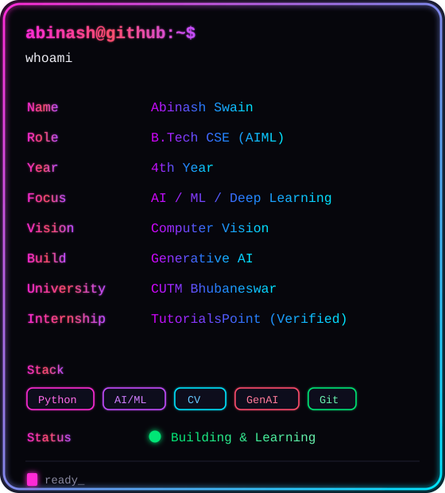
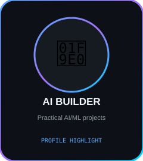
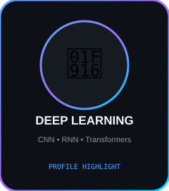
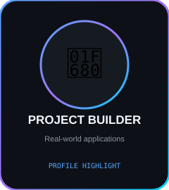
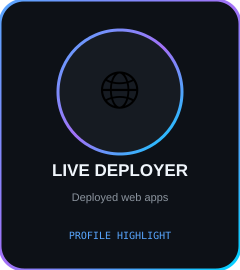

# 🧑‍💻 `abinash123hg@github`

### `abinash123hg@github ~ $ whoami`

<div align="center">




### `echo "Thanks for visiting!"`

**Glad you stopped by!** • **Let's build & grow together.**

</div>

---

## 🧠 Expertise

| Area | Skills | Level |
|---|---|---|
| **Machine Learning** | Classification, Regression, NLP | 🟢🟢🟢🟡⚪ |
| **Deep Learning** | CNN, RNN, Transformers | 🟢🟢🟡⚪⚪ |
| **Python** | OOP, Data Structures | 🟢🟢🟢🟢⚪ |
| **Data Science** | Pandas, NumPy, Matplotlib | 🟢🟢🟢🟡⚪ |
| **Generative AI** | LLMs, Prompting | 🟢🟢🟡⚪⚪ |
| **Git & GitHub** | Version Control | 🟢🟢🟢🟢⚪ |

---

## 🎯 Currently Doing

### 🧠 Learning
- Deep Learning Architecture & Optimization
- Large Language Models (LLMs)
- Production ML Pipelines
- Advanced Algorithms

### 💻 Building
- AI/ML Portfolio Projects
- Streamlit Interactive Dashboards
- Deep Learning Experiments
- ML Research Projects

### 🤝 Open To
- AI/ML Internships
- Project Collaborations
- Open Source Contributions
- Professional Networking

---

## 🏆 Achievements & Profile Badges

<div align="center">

<a href="./ai-builder.svg"></a>
<a href="./deep-learning.svg"></a>
<a href="./project-builder.svg"></a>

<br>

<a href="./live-deployer.svg"></a>
<a href="./data-analyst.svg"></a>
<a href="./continuous-learner.svg"></a>

<br>

<sub>These are custom profile badges, separate from official GitHub Achievements.</sub>

</div>
---

## 💼 Featured Projects

<details open>
<summary><b>🚀 AI/ML Portfolio Projects</b></summary>

| Project | Focus | Tech Stack | Status |
|---|---|---|---|
| **Predictive Analytics** | Regression Models | Python, Scikit-learn, Pandas | Active |
| **Deep Learning Models** | CNNs & RNNs | TensorFlow, Keras, PyTorch | In Progress |
| **NLP Applications** | Text Analysis | NLTK, spaCy, Transformers | Learning |
| **Web Integration** | ML APIs | Django, FastAPI, Streamlit | Building |
| **Data Visualization** | Analytics Dashboards | Matplotlib, Plotly | Active |

</details>

---

## 📚 Education

**Bachelor of Technology (B.Tech)**  
- **Program:** Computer Science & Engineering (AIML Specialization)
- **University:** Centurion University of Technology and Management (CUTM)
- **Current Year:** 3rd Year
- **Focus:** Artificial Intelligence • Machine Learning • Deep Learning • Data Science

**Internship:** TutorialsPoint (Certificate Verified)

---

## 🌐 Connect With Me

<div align="center">

[](https://www.linkedin.com/in/abinash-swain-a941a3330/)
[](mailto:swainabinash839@gmail.com)
[](https://github.com/abinash123hg)
[](https://instagram.com/badnaam_editors)

</div>

---

## 🚀 Featured

### 🛡️ SafeDrive AI
**Real-Time Road Safety & Accident Hotspot Prediction System**

[](https://safedrive-ai.streamlit.app/)
[](https://github.com/abinash123hg/SafeDrive-AI-Real-Time-Road-Safety-Accident-Hotspot-Prediction-System)

### 🧠 DataMind-AI
Intelligent CSV analysis and visualization tool.

[](https://csvintelligence.streamlit.app/)
[](https://github.com/abinash123hg/DataMind-AI)

---

## 💡 Fun Facts

- ⚡ Building AI projects and learning new technologies
- 🎯 Solving real-world problems with AI/ML
- 🚀 Exploring modern AI technologies
- 🤝 Collaborative problem-solving
- 💻 Turning ideas into intelligent solutions
- 😄 **Pronouns:** He/Him

---

## 🔮 Future Roadmap

```yaml
2026:
  Learning:
    - Advanced Deep Learning
    - Generative AI
    - Production ML Systems
    - System Design
  Goals:
    - Build production-ready AI systems
    - Contribute to open source
    - Secure an AI/ML internship
    - Publish meaningful technical work
```

---

<div align="center">

**Thanks for visiting!**  
*Keep building. Keep learning. Keep growing. 🚀*

</div>
