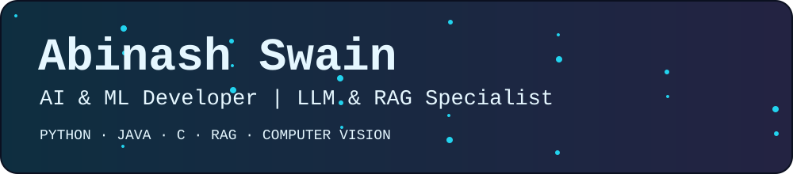
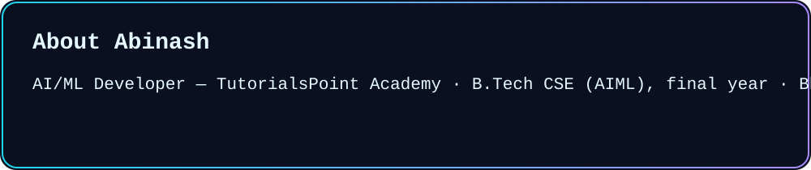
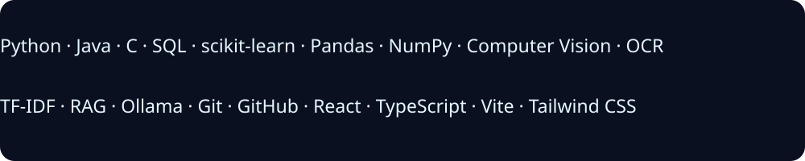
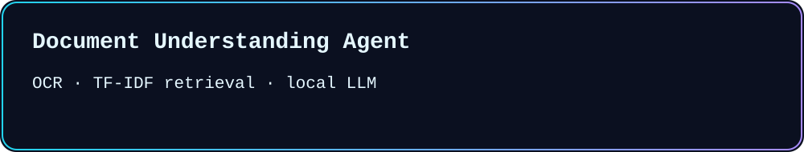
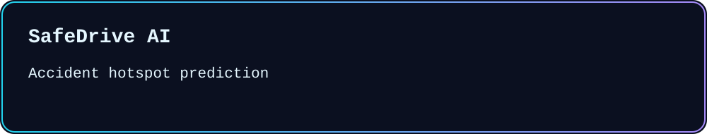
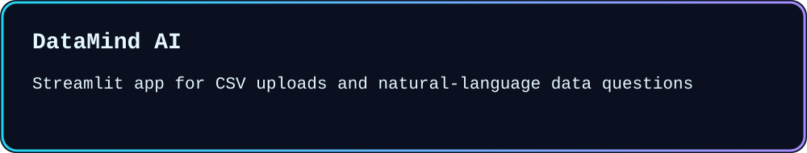
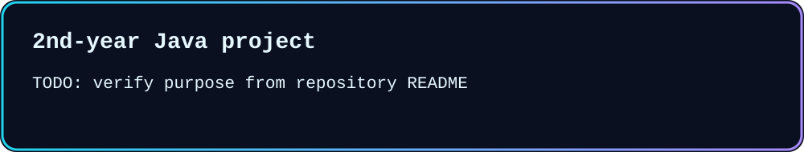
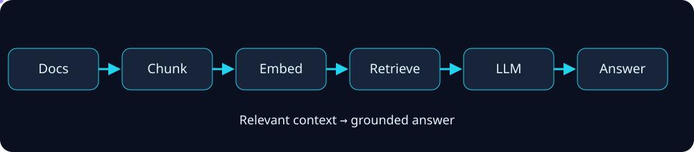
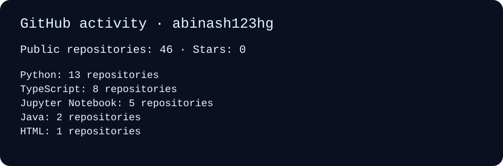
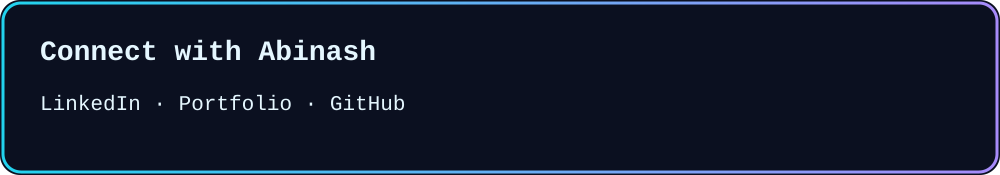

<picture>
  <source media="(prefers-color-scheme: dark)" srcset="assets/hero-dark.svg">
  <source media="(prefers-color-scheme: light)" srcset="assets/hero-light.svg">
  
</picture>

  

## About

**Abinash Swain** — AI & ML Developer | LLM & RAG Specialist at TutorialsPoint Academy, Bhubaneswar, Odisha, India.  
B.Tech CSE (AIML), final year, Centurion University of Technology and Management.  
I work on RAG, neural networks, computer vision, OCR and document-understanding projects.

### Currently
Working on RAG and vision-language projects, and seeking AI/ML opportunities as a final-year student.

## Skills

## Featured Projects

<!-- Verified from the repository README: Streamlit app for CSV uploads and natural-language questions about data. -->

<!-- TODO: Verify the exact project description; the expected README file was not found at the default branch root. -->

## RAG Pipeline

## GitHub Stats

<picture>
  <source media="(prefers-color-scheme: dark)" srcset="assets/stats-dark.svg">
  <source media="(prefers-color-scheme: light)" srcset="assets/stats-light.svg">
  
</picture>

## Contribution Snake

<picture>
  <source media="(prefers-color-scheme: dark)" srcset="https://raw.githubusercontent.com/abinash123hg/abinash123hg/output/github-snake-dark.svg">
  <source media="(prefers-color-scheme: light)" srcset="https://raw.githubusercontent.com/abinash123hg/abinash123hg/output/github-snake.svg">
  
</picture>

## Connect

  <a href="https://www.linkedin.com/in/abinash-swain-a941a3330/">LinkedIn</a> ·
  <a href="https://abinashswainportfolio.netlify.app">Portfolio</a> ·
  <a href="https://github.com/abinash123hg">GitHub</a>

