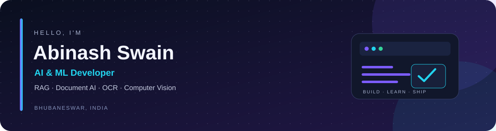
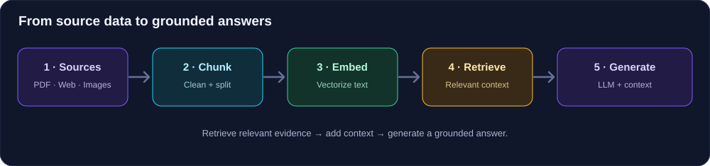
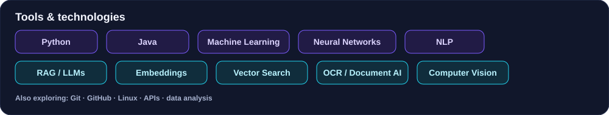

**RAG · Document AI · OCR · Computer Vision**

---

## 👋 About me

Hey, I'm **Abinash Swain**, an AI/ML developer from Bhubaneswar, Odisha, India. I enjoy building practical AI systems that understand documents, retrieve grounded answers, and work with real-world data.

- 🎓 B.Tech CSE (AI & ML), Centurion University of Technology and Management
- 🧠 Focus: Retrieval-Augmented Generation, document understanding, OCR and neural networks
- 🔬 Exploring local LLM pipelines and multimodal AI
- 🤝 Open to collaborating on useful AI/ML projects

## 🚀 Featured projects

<table>
  <tr>
    <td width="50%" valign="top">
      <h3>🧠 <a href="https://github.com/abinash123hg/retrieval-augmented-vision-ai-assistant">Retrieval-Augmented Vision AI Assistant</a></h3>
      
Multimodal retrieval and visual understanding, with an emphasis on grounded responses.

      

        
        
        
      

      <a href="https://github.com/abinash123hg/retrieval-augmented-vision-ai-assistant">View project →</a>
    </td>
    <td width="50%" valign="top">
      <h3>🤖 <a href="https://github.com/abinash123hg/MCP-">MCP WebPilot</a></h3>
      
A local multimodal browser agent using an Ollama model and Playwright. It observes webpages through DOM and screenshots, plans actions, and uses safety checks and audit logs.

      

        
        
        
      

      <a href="https://github.com/abinash123hg/MCP-">View project →</a>
    </td>
  </tr>
  <tr>
    <td width="50%" valign="top">
      <h3>📄 <a href="https://github.com/abinash123hg/document-understanding-agent">Document Understanding Agent</a></h3>
      
Document parsing, OCR workflows, and structured information extraction for turning unstructured files into useful data.

      

        
        
      

      <a href="https://github.com/abinash123hg/document-understanding-agent">View project →</a>
    </td>
    <td width="50%" valign="top">
      
<strong>Building practical AI, one project at a time.</strong>

      
RAG · Document AI · OCR · Multimodal automation

    </td>
  </tr>
</table>
## 🧩 RAG at a glance

## 🧰 Tools & technologies

## 📊 GitHub activity

  
  

## 🐍 Contribution graph

  

## 🤝 Let's connect

  <a href="https://www.linkedin.com/in/abinash-swain-a941a3330/">LinkedIn</a> ·
  <a href="https://abinash-swain-portfolio.netlify.app/">Portfolio</a> ·
  <a href="mailto:swainabinash839@gmail.com">Email</a> ·
  <a href="https://github.com/abinash123hg">GitHub</a>

Built with Markdown and lightweight SVG artwork.

